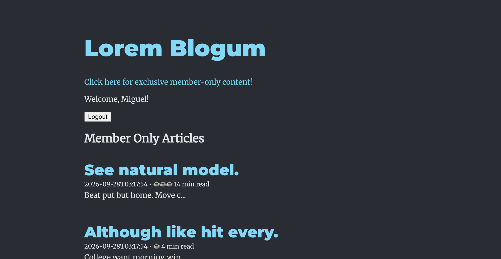

# Lorem Blogum

A small blog with a Flask API and a React client. Anyone can browse articles, with a three-article limit for guests. Signing in with a username stores that user in the Flask session and unlocks member-only articles.



## Features

- List and read articles at `/articles` and `/articles/<id>`.
- Guests can read three articles per session. After that, `GET /articles/<id>` returns `401` with `{"message": "Maximum pageview limit reached"}`.
- Log in with an existing username. The API saves `user_id` on the session cookie.
- Signed-in users skip the pageview limit, and the session survives a refresh via `GET /check_session`.
- Member-only articles live at `/members_only_articles`. Guests receive `401` and `{"error": "Unauthorized"}`. Signed-in users receive only articles where `is_member_only` is true, and can open one by id at `/members_only_articles/<id>`.

## API

| Method | Path | Who can use it |
| --- | --- | --- |
| `GET` | `/articles` | Anyone |
| `GET` | `/articles/<id>` | Anyone, with a guest pageview limit |
| `POST` | `/login` | Body: `{"username": "..."}`. Returns the user, or `401` if the username is unknown |
| `DELETE` | `/logout` | Clears `user_id` |
| `GET` | `/check_session` | Returns the current user, or `401` |
| `GET` | `/members_only_articles` | Signed-in users only |
| `GET` | `/members_only_articles/<id>` | Signed-in users only |
| `DELETE` | `/clear` | Clears `user_id` and `page_views` |

## Setup

Python dependencies are in the `Pipfile`. The client proxies API requests to `http://localhost:5555`.

```bash
pipenv install
pipenv shell
npm install --prefix client
cd server
flask db upgrade
python seed.py
```

`seed.py` creates users and articles. Member-only rows are about one third of the articles. Use any seeded username to log in (passwords are not part of this app).

## Run

In one terminal, from `server`:

```bash
python app.py
```

The API listens on port 5555. In another terminal, from the project root:

```bash
npm start --prefix client
```

The client listens on port 4000. Open it, log in, then use **Click here for exclusive member-only content!** Guests see `Unauthorized` on that page.

## Tests

From the project root, with the virtualenv active:

```bash
pytest
```

The suite checks that `/members_only_articles` and `/members_only_articles/<id>` return `200` for a signed-in user, `401` after logout, and that the index includes only member-only articles.
